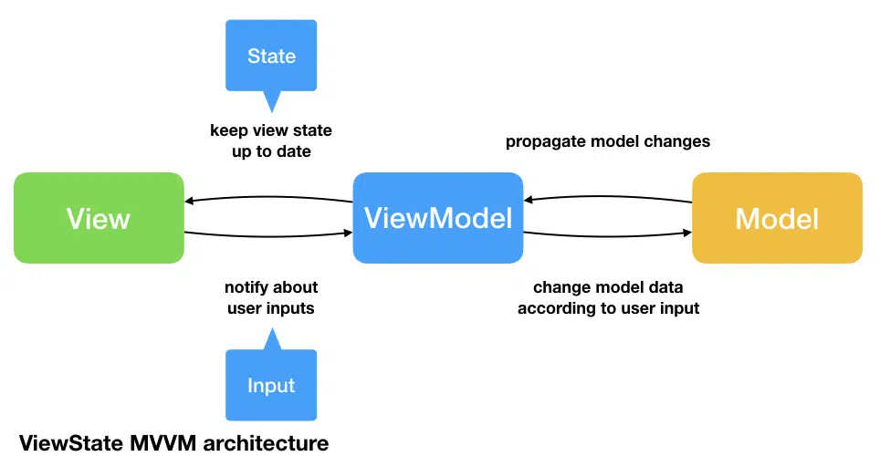
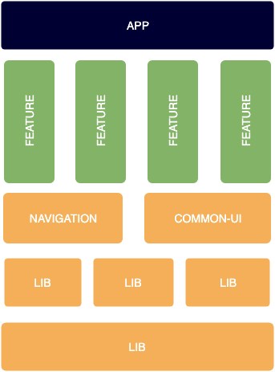

# ``foursquare``

Little app that allows to see the nearby places using the foursquare api.

## Overview

The project is modularized from the start, because I want to exemplify and discuss this way of modularizing and app, you don't really needed it for such a small project.
It has "Horizontal" modules, i.e. the FoursquareAPI package, and "Vertical" modules, i.e. the PlaceList package.
This way of modularizing allows to independently develop features in different modules, while reusing the logic that makes sense, like networking, tracking, logging, etc.
Modules are independent from each other, creating a good and flexible separation of concerns. And, also allows for faster building times.

Source: https://quickbirdstudios.com/blog/swiftui-architecture-redux-mvvm/

The architecture chosen for the PlaceList module is MVVM. Which, in hindsight, might not have been the best in combination with my limited knowledge of SwiftUI. 

Basic dependency injection was achieved using a factory pattern, this could be improved using a proper dependency injection tool, like Swinject.

In addition to the View and ViewModel I used Entinties and Repositories, trying to follow basic Clean Architecture principles and keeping it simple. You'll see that the ["Dependency Rule"](https://blog.cleancoder.com/uncle-bob/2012/08/13/the-clean-architecture.html) is mostly followed.

Source: https://www.miquido.com/blog/android-project-modularisation/

## Not implemented

### location & radius based search
Due to lack of time the radius based search was not implemented.

### Localization
There are many string floating around on the view model. Normally these would be localized.

### Proper setup of API parameters
The api url and key are hardcoded in the "app delegate". These should be properly setup in configuration files.

### Commit history
The project has been developed ove a few days in between meetings and life itself and commited as is when done.

### Testing coverage
There is minimal testing, mostly as an example or to spark a conversation about testing. In a real project there would be more attention in this aspect.

### Proper UI 
As you can see the UI is very basic, but has most of the components needed to extend it using the same architecture.
Apart from Navigation, that's a whole different topic that I'd be happy to discuss.

### Documentation
Documentation of the code is missing. Depending on the team and needs of the project we can go without commenting the code to fully document every method and variable.
